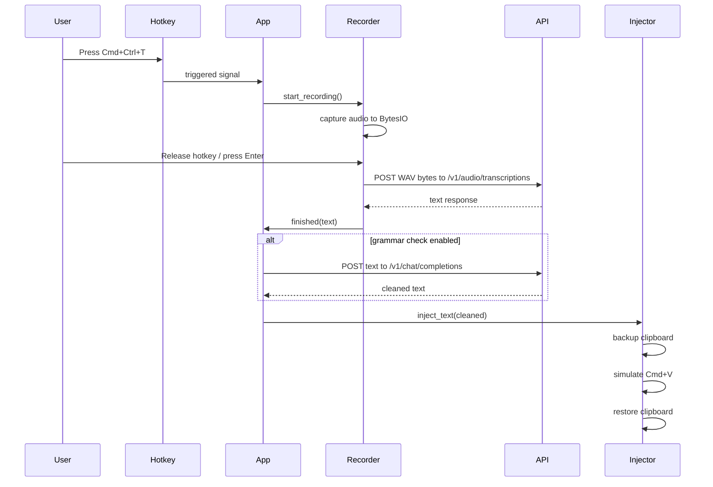

# UI Wireframes

Visual design specifications for the Whisper-Code interface.

---

## macOS Menu Bar Status Icon

Whisper-Code runs as a background application. Its primary point of contact is the macOS system tray / menu bar.

### Menu Bar Icon States

* **Idle / Ready:** 🎙️ (Grayed-out/Outline)
* **Active / Recording:** 🔴 (Red circle / Pulsing microphone)
* **Processing / Transcribing:** ⏳ (Spinning loader)

---

## Transient Wave Overlay

When the application is in the **Listening (Active)** state, a small, highly polished, translucent HUD (Heads-Up Display) overlay appears at the bottom-center of the screen, providing instant visual feedback.

### Layout

```
┌─────────────────────────────────────────┐
│                 Listening               │  ← Translucent text
│                                         │
│               ▂ ▃ ▅ █ ▅ ▃ ▂             │  ← Audio dynamic waveform
│                                         │
│              [Press ESC to Stop]        │
└─────────────────────────────────────────┘
```

* **Styling:** Glassmorphic background (acrylic blur), white text/wave.
* **Wave Animation:** Smooth vertical bar scaling based on real-time microphone input volume levels.
* **Positioning:** Automatically positioned at the bottom-center of the main display. Fade-in on activation, fade-out on stop.

---

## Toast Notifications

Small, non-intrusive popups for status feedback.

### Success Toast

```
┌─────────────────────────────────────────┐
│  ✓  Transcription complete               │  ← Success
└─────────────────────────────────────────┘
```

* Background: #4CAF50 (green)
* Text: white
* Duration: 1.5s
* Position: bottom-right of indicator

### Error Toast

```
┌─────────────────────────────────────────┐
│  ✕  Microphone not available             │  ← Error
└─────────────────────────────────────────┘
```

* Background: #F44336 (red)
* Text: white
* Duration: 3s
* Position: bottom-right of indicator

### Warning Toast

```
┌─────────────────────────────────────────┐
│  ⚠  No speech detected                   │  ← Warning
└─────────────────────────────────────────┘
```

* Background: #FF9800 (orange)
* Text: white
* Duration: 2s
* Position: bottom-right of indicator

---

## Settings Panel

Configurable settings dialog for customization.

```
┌─────────────────────────────────────────┐
│  ⚙️ Settings                    [✕]     │
├─────────────────────────────────────────┤
│                                         │
│  Hotkey                                 │
│  ┌───────────────────────────────────┐  │
│  │ [Option] [Option]                │  │  ← Double-tap config
│  └───────────────────────────────────┘  │
│                                         │
│  Sensitivity                            │
│  ─○────────●────────○────────          │  ← Slider
│  Low        Medium       High           │
│                                         │
│  Eco Mode                               │
│  [ ] Unload model when idle (save RAM)  │  ← Checkbox
│                                         │
│  Model Size                             │
│  ┌───────────────────────────────────┐  │
│  │ Large V3 Turbo ▼                   │  │  ← Dropdown
│  └───────────────────────────────────┘  │
│                                         │
│  Language                               │
│  ┌───────────────────────────────────┐  │
│  │ English (US) ▼                   │  │  ← Dropdown
│  └───────────────────────────────────┘  │
│                                         │
│  Theme                                  │
│  ● Dark                                │  ← Radio
│  ○ Light                               │
│                                         │
│  ┌──────────────┐  ┌──────────────┐    │
│  │  Apply       │  │  Cancel      │    │
│  └──────────────┘  └──────────────┘    │
│                                         │
└─────────────────────────────────────────┘
```

## Sequence diagram



---

## Color Palette

| Role | Color | Hex |
|------|-------|-----|
| Primary | Green | #4CAF50 |
| Secondary | Blue | #2196F3 |
| Warning | Orange | #FF9800 |
| Error | Red | #F44336 |
| Text | Dark | #212121 |
| Background | Light | #F5F5F5 |
| Border | Gray | #E0E0E0 |

---

## Typography

| Element | Font | Size | Weight |
|---------|------|------|--------|
| Title | System (SF Pro) | 13px | Semibold |
| Toast text | System (SF Pro) | 12px | Regular |
| Settings label | System (SF Pro) | 12px | Medium |
| Settings value | System (SF Pro) | 12px | Regular |

---

## Sizing

| Element | Size |
|---------|------|
| Main window | 200x120px |
| Icon | 32x32px |
| Settings panel | 280x320px |
| Toast | Auto (max 250px) |
| Toast height | 32px |
