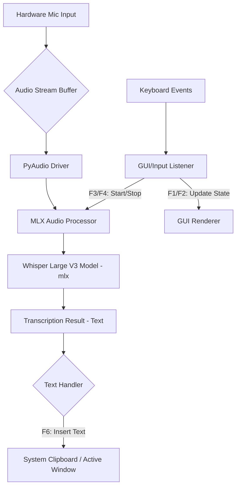
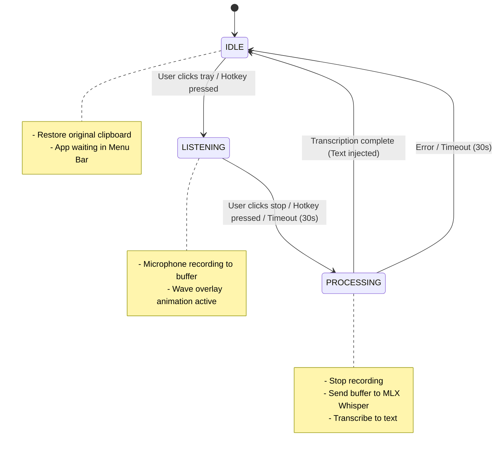

# Technical Specification

**Objective:** Implement a Python application that ties together a GUI framework, OS-level input hooks, and the MLX/Whisper audio pipeline.

## 1. Technology Stack

| Layer | Technology | Rationale |
| :--- | :--- | :--- |
| **Core Language** | Python 3.10+ | Primary language requirement. |
| **GUI Framework** | PyQt5 | Advanced visual effects (wave animation). |
| **Audio I/O** | PyAudio | Standard library for microphone input/streaming. |
| **STT Engine** | `mlx.audio` | Handles audio processing and model loading. |
| **ML Model** | `mlx-community/whisper-large-v3-turbo-asr-fp16` | Whisper model for speech-to-text. |
| **Global Hooks** | `pynput` (macOS) | Listens for keyboard shortcuts when app is not in focus. |
| **System Interaction** | `pyperclip` | Copies transcribed text to system clipboard. |

## 2. System Architecture Diagram



## 3. State Machine Diagram



## 4. Error Handling Strategy

| Error Type | Trigger | UI Feedback | Recovery Action |
|------------| :--- | :--- | :--- |
| **Mic Unavailable** | Permission denied / Hardware error | Red toast: "Microphone not available" | Disable mic, show restart button |
| **STT Timeout** | No speech detected after buffer | Gray toast: "No speech detected" | Wait longer or stop |
| **STT Model Error** | Whisper inference fails | Red toast: "Model error, try restarting" | Auto-restart suggestion |
| **Clipboard Error** | macOS clipboard permission | Yellow toast: "Clipboard access denied" | Offer file output alternative |
| **No Active Window** | Not in text field | Warning icon / Toast | Keep text in clipboard, show notification |
| **High Background Noise** | SNR < threshold | Warning overlay on wave icon | Lower sensitivity or stop |

## 5. Data Persistence

* **Settings Storage:**
  * Format: JSON file (`~/.config/whisper-code/settings.json`)
  * Contents: Hotkey config, sensitivity, language, UI theme
  * Auto-load on startup, auto-save on change
* **History Storage (Optional):**
  * Format: SQLite database or JSONL file
  * Contents: Timestamp, original audio, transcription, confidence score
  * Auto-delete after X days or Y sessions

## 6. Security & Privacy Details

* **Local Processing Only:** All audio processing happens on-device via MLX
* **No Audio Recording:** Audio chunks are processed in-memory and discarded immediately
* **No Telemetry:** No usage data sent to external servers
* **Clipboard Handling:** User must explicitly grant clipboard access (macOS requires system prompt)
* **Model Download:** One-time download from HuggingFace/MLX, stored locally
* **Encryption:** Optional encryption for settings file (AES-256)

## 7. Testing Strategy

* **Unit Tests:**
  * `test_audio_chunk_processing()` - Verify audio preprocessing
  * `test_whisper_inference()` - Verify transcription accuracy
  * `test_state_transitions()` - Verify state machine logic
* **Integration Tests:**
  * Full audio stream to text output pipeline
* **UI Tests:**
  * Verify visual state changes (idle → listening → processing → idle)
  * Verify toast notifications appear correctly
* **Edge Case Tests:**
  * Test with background noise
  * Test rapid stop/start
  * Test with different microphones
* **Platform Tests:**
  * macOS: Verify native menu bar integration
  * macOS: Verify hotkey works across apps
  * macOS: Verify permissions handling

## 8. Project Structure (Proposed)

```
whisper-code/
├── main.py                     # Application entry point (Tray Icon & bootstrap)
├── config/
│   └── settings.json           # User settings
├── src/
│   ├── __init__.py
│   ├── gui/
│   │   ├── tray_menu.py        # System tray menu and configuration panel
│   │   └── wave_overlay.py     # Translucent on-screen wave indicator (listening state)
│   ├── core/
│   │   ├── audio_recorder.py   # PyAudio recorder writing to in-memory buffers
│   │   ├── mlx_transcriber.py  # MLX Whisper inference thread
│   │   └── hotkey_listener.py  # Pynput global keyboard hook
│   └── utils/
│   │   ├── text_injector.py    # Clipboard copy-paste helper with restore
│   │   └── config_manager.py   # Settings load/save (JSON)
│   └── exceptions.py           # Custom exception definitions
├── tests/
│   ├── test_audio.py
│   ├── test_whisper.py
│   └── test_gui.py
├── models/
│   └── whisper-model.bin       # Downloaded MLX model
├── assets/
│   ├── icons/
│   └── sounds/
└── requirements.txt
```

## 9. Documentation Structure

```
docs/
├── README.md              # Project overview & quick start
├── PRD.md                 # Product requirements
├── system-architecture-diagram.md  # Technical spec
├── INSTALLATION.md       # Setup instructions
├── CHANGELOG.md          # Version history
├── PACKAGING.md          # Build & distribute
├── UI-WIREFRAMES.md      # Visual design specs
├── ROADMAP.md            # V1 → V2 → V3 timeline
└── api-reference.md      # Module interfaces
```

## 10. Database Schema (Optional)

```sql
-- Session history table
CREATE TABLE transcription_history (
    id INTEGER PRIMARY KEY AUTOINCREMENT,
    timestamp DATETIME NOT NULL,
    raw_audio_path TEXT,     -- Path to temporary audio file
    transcription TEXT NOT NULL,
    confidence REAL,         -- 0.0 to 1.0
    language TEXT,
    duration_seconds REAL
);

CREATE INDEX idx_timestamp ON transcription_history(timestamp);
```

## 11. Future Enhancements (V2.0+)

* **Continuous Dictation:** The app remains listening until stopped by a specific command (e.g., "Stop").
* **Command Detection:** Integration of wake words ("Hey Whisper") to trigger activation.
* **Language Selection:** Allowing the user to specify the input language.
* **History Log:** Storing and viewing past transcribed sessions.
* **Auto-Paste:** Directly paste text into active window (V2 feature)
* **Multiple Languages:** Support for different input languages
* **Custom Models:** Allow users to load their own Whisper models
